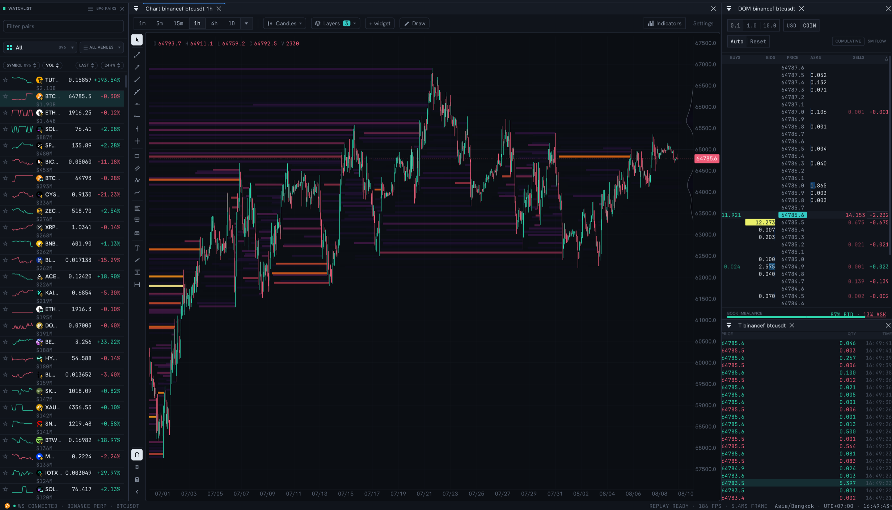

# EdgeDepth Terminal

**An open-source orderflow terminal and local market-data replay/testing workbench that runs in your browser at 170+ FPS.**

C++20 compiled to WebAssembly. Dear ImGui + ImPlot for immediate-mode rendering, SDL3 + WebGL2 underneath, protobuf over WebSocket for data. No Electron, no DOM in the hot path, no garbage collector between you and the tape.



This is the full source of the terminal that powers [EdgeDepth](https://edgedepth.com/open-source?utm_source=github&utm_medium=oss&utm_campaign=terminal): the same canvas, the same widgets, the same render loop. It is not a demo build or a stripped-down "community edition."

Run it against a local exchange feed, point it at your own wire-compatible data,
or use deterministic `.edpack` recordings as repeatable fixtures. If you prefer
a managed feed and stored history, open the [hosted live terminal](https://app.edgedepth.com/terminal?utm_source=github&utm_medium=oss&utm_campaign=terminal).

## Quick start

The terminal and a live market data feed, both on your machine:

```bash
git clone https://github.com/edgedepthhq/edgedepth-terminal.git
cd edgedepth-terminal
docker compose up
```

Then open **http://localhost:8080**. No API key, no account, no signup. The
feed is [edgedepth-gateway](https://github.com/edgedepthhq/edgedepth-gateway),
a small MIT-licensed Go service that bridges Binance's public WebSocket
streams into this terminal's wire format.

Images are pulled prebuilt so this starts in seconds. To compile the
WebAssembly from source instead, `docker compose up --build` (that pulls the
Emscripten toolchain and takes a while).

## Why this exists

Web trading UIs are usually React apps fighting the DOM for every orderbook tick. This terminal takes the approach used by native trading software, an immediate-mode GUI redrawn every frame on the GPU, and ships it through WebAssembly. A full orderflow stack (chart, DOM ladder, tape, heatmap) renders at 170+ FPS in a browser tab with frame times around 5ms.

Open-source trade aggregators and charting components exist, but complete browser orderflow terminals in this class are rare. Most mature orderflow tools are closed and paid. This one is open: read it, build it, point it at your own data.

## Features

- **Chart engine**: custom ImPlot candlesticks, multi-timeframe (1m to 1D), buy/sell volume + CVD, indicators (RSI, MACD, Volume, OI, funding), drawing tools, layered overlays
- **DOM ladder**: full depth-of-market with grouping, USD/coin modes, cumulative view, book imbalance
- **Trade tape**: live time & sales with size highlighting
- **Orderbook heatmap**: GPU-rendered depth history via a shader-based renderer
- **Volume profile (VPVR), TPO / Market Profile, footprint**: built client-side from per-price tick volume
- **Liquidation heatmap layers**: the dense liquidation Field, leverage-tier levels, and profile rendering. The Field is computed client-side from candles, so it works on any feed
- **Market replay**: deterministic replay engine with scrubbing, and self-contained `.edpack` files that play entirely client-side with no server
- **Replay Library**: a manifest-driven browser of free, curated `.edpack` recordings for local replay and regression testing
- **Paper trading**: simulated positions against live data
- **Docking layout**: drag, split, and persist panel arrangements (ImGui docking)
- **Watchlist / scanner**: 800+ Binance Futures pairs with 24h stats
- **Wire format**: zstd-compressed protobuf ([`protos/messages.proto`](protos/messages.proto)), decoded off the render thread

## Bring your own data

The terminal is a client. It speaks a documented protobuf-over-WebSocket wire format and connects to whatever feed you give it, resolved in this order:

1. `?ws=ws://localhost:8080/ws` (query parameter)
2. `window.__EDGEDEPTH_WS_URL__` (set by the host page before the WASM glue loads)
3. `wss://api.edgedepth.com/ws` (EdgeDepth's hosted backend, the default)

The schema in [`protos/messages.proto`](protos/messages.proto) is the whole contract. A feed that emits trades, candles, orderbook updates, stats, and liquidation events, all derivable from any exchange's public streams, lights up the chart, DOM, tape, orderbook, heatmap, liquidation Field, volume profile, TPO, and paper trading.

**Community gateway:** [edgedepth-gateway](https://github.com/edgedepthhq/edgedepth-gateway) is exactly that feed, MIT licensed. It serves trades, candles, orderbook, stats and liquidations from Binance's free public streams, and answers historical candle requests from their REST klines so the chart boots with real history. It also builds **1s, 5s, 15s and 30s candles** trade by trade from the raw stream, updating the building candle as each trade arrives. See the [Quick start](#quick-start) to run both together.

A few layers are driven by EdgeDepth's proprietary analytics streams: VPIN toxicity, positioning and smart-money flow, modelled liquidation estimates, pattern detection, and the scanner's composite scores. With a raw-data feed those panels simply stay empty and the terminal degrades gracefully. The [hosted product](https://app.edgedepth.com/terminal?utm_source=github&utm_medium=oss&utm_campaign=terminal) provides them, along with historical replay and structured courses taught inside the terminal.

The main dividing line is time. Your local terminal starts recording when you
install it. EdgeDepth has already been recording 660+ markets for months. Pro
lets you replay an arbitrary moment from the last 30 days.

Research serves a different job: testing how often a defined condition occurred
and what followed across a 90-day record. It includes a larger search budget plus
REST API and MCP access. See [plans](https://edgedepth.com/pricing?utm_source=github&utm_medium=oss&utm_campaign=terminal) only when you need stored history or archive-wide evidence.

## Replay Library and local test packs

No feed is required for a recording. In the top bar choose **Replay**, then
**Open Replay Library**. If a chart is already open, the same widget is under
**+ widget**, then **Replay Library**. A selected pack streams directly from
static hosting and replays locally with no account or replay server.

The checked-in [`replay-library/manifest.json`](replay-library/manifest.json)
is also the production catalog source. It starts with one verified ZEC event;
additional picks can be published without rebuilding the terminal.

The terminal can play a self-contained `.edpack` recording entirely
client-side: orderbook, tape, liquidations, footprint and volume profile
included, with nothing but static file hosting behind it.

```
?pack=<url-encoded pack URL>&packsym=<symbol>
```

Try the catalog's first recording directly: 30 tick-by-tick minutes from a
June 2026 ZEC selloff, including the order book, tape, liquidations, footprint
and volume profile data (53 MB):

```
http://localhost:8080/?pack=https%3A%2F%2Freplays.edgedepth.com%2Freplays%2Fzec_cascade_demo%2Fv1.edpack&packsym=zecusdt
```

The pack is fetched with HTTP range requests, block by block, as playback and
seeking need it. If you host packs yourself, the server (and any CDN in front
of it) must allow the `Range` header in its CORS policy and answer
`206 Partial Content`; a server that ignores `Range` and answers `200` with
the whole body forces the client to buffer the entire file into memory.

To use the widget with a private or local corpus, point it at another v1
manifest without rebuilding:

```text
?replayLibrary=http%3A%2F%2Flocalhost%3A9000%2Fmanifest.json
```

Or set `window.__EDGEDEPTH_REPLAY_LIBRARY_URL__` before the WebAssembly glue
loads. See [`replay-library/README.md`](replay-library/README.md) for the
manifest and CORS contract. The self-hosted client contains no phone-home
analytics; public pack engagement can be measured from aggregate object
requests at the pack host.

## Building

Prerequisites, and the versions matter:

- [Emscripten SDK](https://emscripten.org/docs/getting_started/downloads.html) **4.0 or newer**. The client builds with `-sUSE_SDL=3`, and the SDL3 port does not exist in Emscripten 3.x, where the build fails with `SDL3/SDL.h file not found`.
- **`protoc` 21.x**, to match the protobuf v21.12 runtime CMake fetches. Distro packages are usually too old: Ubuntu 22.04 ships 3.12.4, which generates headers the runtime rejects. CMake checks this and tells you if it is wrong.
  ```bash
  curl -fsSLO https://github.com/protocolbuffers/protobuf/releases/download/v21.12/protoc-21.12-linux-x86_64.zip
  sudo unzip -o protoc-21.12-linux-x86_64.zip -d /usr/local
  ```
- CMake 3.15+.

If you would rather not install any of this, `docker compose up --build` does the whole thing in a container.

```bash
source /path/to/emsdk/emsdk_env.sh

git clone https://github.com/edgedepthhq/edgedepth-terminal.git
cd edgedepth-terminal

# Threaded build (pthreads, needs COOP/COEP headers to run, see below)
mkdir build-threaded && cd build-threaded
emcmake cmake -DCMAKE_BUILD_TYPE=Release ..
emmake make -j$(nproc)
```

All other dependencies (ImGui docking, ImPlot, zstd, protobuf-lite, nlohmann/json) are fetched and pinned by CMake. No submodules, no system libraries.

Serve it. The threaded build requires cross-origin isolation for `SharedArrayBuffer`, and the bundled dev server sets the headers:

```bash
cd ..
python3 serve_threaded.py 8000 build-threaded
# open http://localhost:8000                             connects to EdgeDepth's hosted feed
# open http://localhost:8000?ws=ws://localhost:8080/ws   connects to your own feed
```

## Design system

The terminal's visual language (surfaces, text ramp, market-data semantics, heatmap LUTs) lives in [`design/`](design/README.md) as tokens, CSS, and ImGui mapping notes. `src/rendering/theme.{h,cpp}` mirrors those tokens into ImGui/ImPlot styles at runtime, so restyling starts there rather than in widget code.

## Architecture in one paragraph

A dedicated worker thread owns the WebSocket, zstd decompression, and protobuf decode. Parsed messages flow through lock-guarded managers (orderbook, candles, heatmap, liquidations) that the render thread reads. The main loop is a single ImGui frame: every widget draws from current manager state, every frame, and the GPU does the rest, including the orderbook heatmap and liquidation Field, which render as shader-driven texture quads rather than per-cell draw calls. The replay engine substitutes the live feed with a time-ordered historical stream and drives the same managers, so live and replay are pixel-identical code paths.

## Contributing

Issues and PRs welcome. The most valuable contributions right now:

- Feed adapters for other exchanges and venues (the wire format is the contract)
- Widget improvements and new indicators
- Build and tooling portability (it should compile anywhere emsdk runs)

Please keep PRs focused. The render loop has strict conventions: no allocation in the frame path, `PriceFormatter` for all price text, theme tokens for all colors. See [CONTRIBUTING.md](CONTRIBUTING.md).

## Related projects

- [edgedepth-gateway](https://github.com/edgedepthhq/edgedepth-gateway) (MIT): the self-host feed this terminal connects to, bridging Binance's public streams into the wire format, with a pluggable exchange layer for adding venues.
- [edgedepth-research-mcp](https://github.com/edgedepthhq/edgedepth-research-mcp) (MIT): a Model Context Protocol server that lets Claude, Cursor, or any MCP client search EdgeDepth's recorded microstructure: every verified occurrence of a market condition, with forward outcomes and replay-linked evidence that opens in this terminal.

## License

[AGPL-3.0](LICENSE). You can use, modify, and self-host freely. If you host a modified version for others, you must publish your changes. Fonts are OFL-licensed (Hanken Grotesk, JetBrains Mono), and third-party library licenses are listed in [THIRD_PARTY_NOTICES.md](THIRD_PARTY_NOTICES.md).

---

Built by [EdgeDepth](https://edgedepth.com/open-source?utm_source=github&utm_medium=oss&utm_campaign=terminal): real-time crypto microstructure, liquidation heatmaps, orderflow analytics, and courses taught inside the live terminal.
