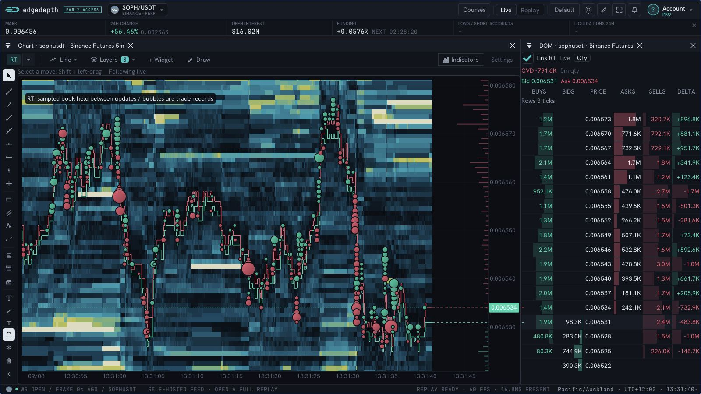
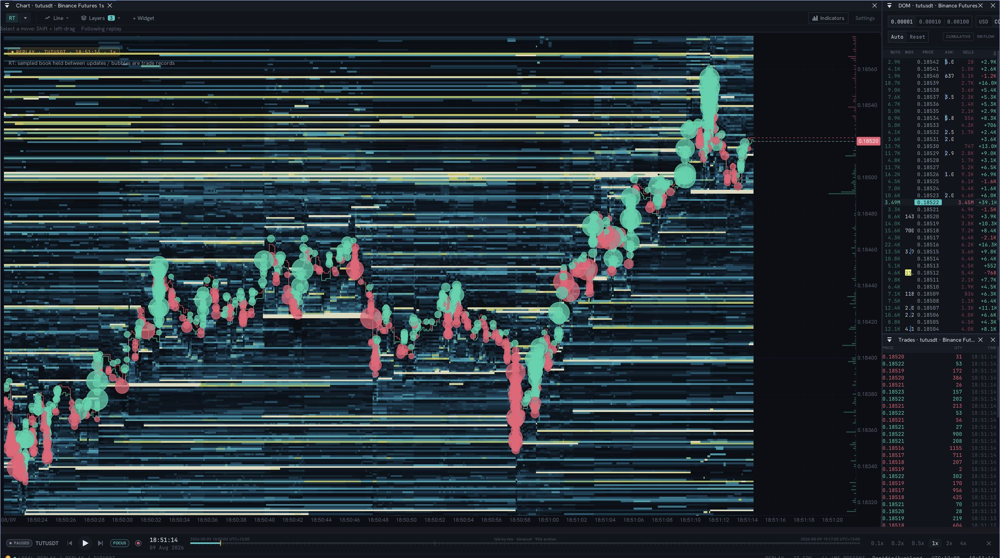

# Real-time depth and trade bubbles

Select **RT** in the chart's timeframe menu. The default view combines observed
resting liquidity, historical best bid/ask steps and received trade records.
It opens without candles. The right gutter shows the current fresh book.

*Real SOPH/USDT market data through the community gateway, captured from a local
browser build on 8 September 2026, with linked DOM delta and CVD. The gateway requests Binance depth at 100ms; this is not a
measurement of the hosted feed's cadence or performance.*

## Reading a bubble outside the spread

The **center** is the received trade's timestamp and execution price. Its radius
represents size, so its edge can cross either quote even when its center is at
that quote. Green means buy aggressor; red means sell aggressor. This does not
identify a trader or say whether they opened or closed a position.

The quote lines come from synchronized depth observations, keeping the first
actual event in each 100ms display bin. Trades retain their own source timestamps.
These are separate streams, not an atomic quote-and-trade record. Prices can move
between depth observations, and an aggressive order can execute at several prices.
A trade center outside the *displayed sampled* spread is therefore possible.
It is not proof of an erroneous fill, nor proof that the sampled quote was the
executable quote at that exact instant. Never clamp trades to the drawn lines.
[Binance documents the separate depth and trade streams](https://developers.binance.com/en/docs/catalog/core-trading-derivatives-trading-usd-s-m-futures/api/ws-streams/public).

Each bubble is one received record. A source may aggregate fills, and this wire
format has no trade IDs for reliable deduplication. The renderer preserves the
received price, time, quantity and side; it cannot verify every exchange fill
from a screenshot.

## Settings

| Location | Control | Effect |
| --- | --- | --- |
| Timeframe > RT | Pause display | Live only: freeze the displayed book, clock and trades while collection continues. Replay uses its transport pause. |
| Timeframe > RT | 1s observed candles | Show partial one-second OHLC from received trades. These are not historical candle backfill. |
| Timeframe > RT | Trade-price line | Connect eligible observed trade prices. |
| Timeframe > RT | Trade bubbles | Show or hide trade markers. |
| Timeframe > RT | Auto market size | Default on. Minimum is based on the 75th percentile of received quote notionals over 60 seconds. After at least 32 eligible records, the reference stays fixed until explicit recalibration or replay reset. |
| Timeframe > RT | Recalibrate bubble sizes | Reset the automatic size reference using eligible received records. This deliberately resizes and refilters historical bubbles. |
| DOM | Link RT | Default on. Use the matching RT chart's sampled book, display clock and exact price-to-screen mapping. Includes buys, sells, delta and CVD. Turn off for independent centering and reset controls. |
| Timeframe > RT | Minimum trade value | With auto off, set price times quantity in quote units. For a USDT pair, the threshold is in USDT. Default manual value: 10,000. |
| Layers > Depth settings | Fidelity | UHD/HD/SD/LD/ULD group 1/2/5/10/20 native price ticks. RT keeps the chosen grouping fixed; candle-mode zoom adaptation is separate. |
| Layers > Depth settings | Recalibrate colors | Explicitly recalibrate brightness from the currently visible liquidity. This deliberately recolors history; normal feed updates do not. |
| Chart navigation | Time zoom / Follow | Show five seconds to two minutes. Wheel zoom keeps Following live/replay in both directions. Pan detaches; zoom in then keeps the inspected history. While running, zoom out resumes Follow. Paused history stays detached in both directions. Follow returns to the current display clock without unpausing; use Pause display or the replay transport to resume time. Price auto-fits eligible visible trades and quote steps. |

Bubbles use square-root radius scaling from 3px to a 12px cap. Values at or above
16 times the minimum share the cap. Flat signed fills and thin dark edges reduce pale overlapping clusters. Quote lines have
dark backing so they remain visible over bright liquidity. Newer records draw on top, with
all centers kept at their received timestamps and prices. Up to 20,000 trade
records/two minutes are retained, and the newest 1,500 qualifying records in view
are drawn. Auto size is independent of chart zoom. During warm-up the reference may
settle every five seconds; after 32 eligible records it stays fixed. Explicit
recalibration or changing the manual threshold can change which historical
markers qualify. Neither changes heatmap cells.

## Linked DOM

The matching instrument's existing DOM links by default when RT is active.
Charts render before DOMs each frame: the ladder consumes the chart's final
price bounds and absolute screen coordinates after zoom, pan and resize.
It never independently recenters or stretches prices to fill its own panel.
A hidden chart produces a waiting state, not a stale transform.

Linked mode shows the same immutable sampled book as the RT chart, including
its 100ms sampling, 512-level-per-side coverage, 15-second freshness boundary,
live display pause and replay as-of clock. It does not use the independent
DOM's current read buffer. The six columns show buys, bids, price, asks,
sells and delta. Trade flow advances only through the chart clock. The CVD
header is received buy quantity minus sell quantity since the latest reset;
it resets every five minutes of market time, not wall time. It starts when RT
is enabled and is not a backfilled exchange-session total. CVD stays in base
quantity when the row display switches to quote value.

The header prints exact best bid/ask, their spread in price units and native
ticks, with Native BBO or Depth BBO identifying the quote source. Native
quotes and sampled depth have separate ages at the chart clock. Pause freezes
both observations and their ages. A one-tick spread may be smaller than one screen pixel. The two gutter
markers use separate horizontal halves so both remain identifiable without
moving either vertically. No minimum visual spread is manufactured.

At wider price ranges, nearby native ticks are summed into readable rows;
**Rows N ticks / centers** states the grouping. PRICE labels are bucket centers,
not native executable quotes; bids and asks can share a grouped row. Both resting depth and traded volume use
the same row groups. This changes the ladder display only, not historical
heatmap fidelity or trade coordinates. Best bid/ask lines retain their exact
prices, also printed in the header. Qty / Quote toggles row amounts between
base quantity and the sum of each actual price times quantity.

Live depth interruptions request a fresh seed after three seconds of unhealthy
RT state, with retries no more than once every five seconds per subscription.
Sequence validation remains strict and the missing interval stays visible.
Replay never requests live recovery. Unverified pack seeks still withhold depth.
The header identifies live/replay and paused state.

Pausing freezes CVD and all flow columns along with the chart. Reception stays
bounded to 20,000 pending trade records. If a long, busy pause exceeds that
budget, resuming starts fresh totals and displays **reset after gap** instead
of presenting incomplete accumulation as continuous CVD.

For a simple vertical DOM/tape split, linked mode temporarily hides the matching
tape so the ladder can use the full right column. Turning linking off or leaving
RT restores the tape and split. Floating and tabbed arrangements are preserved;
rows outside a custom panel's bounds are clipped, never moved to fit.
Independent mode is explicitly labelled and may continue updating while the RT
chart's live display is paused. Close the independent panel or restore linking
when comparing a frozen chart with depth.

## Why historical depth stays fixed

An observation owns its original time, prices and quantities. New columns and
GPU rebuilds use the same absolute price grid, including after the oldest samples
expire. RT does not automatically regroup historical rows as the price axis fits.
The color scale calibrates from grouped visible liquidity at the 98th percentile,
then stays fixed. A large new order cannot recolor all earlier observations.

Changing fidelity explicitly recalibrates the scale and redraws price groups;
Recalibrate colors updates brightness without changing the price grouping;
replay resets start a new traversal. The fixed scale can saturate unusually large
new orders or make thinner new liquidity look dim. Recalibrate only when you
want a new reference for the visible market. Scrolling and price auto-fit still change screen coordinates for the
whole chart. Those axis transformations are distinct from rewriting a past price
level or quantity. The history remains anchored to market coordinates.

## Replay: verified workflow and current limitation

*Actual TUT v2 pack playback, paused on 9 August 2026. The screenshot uses the
Pacific/Auckland display timezone (UTC+12). This is a local recording, not live
market data or proof of hosted deployment.*

1. Open the TUT recording from the Replay Library at its beginning.
2. Select **RT** in the chart timeframe menu.
3. Play forward to build observed depth. Use the transport speed controls to slow
   the tape, then pause to inspect it. All RT evidence is bounded by the playhead.
4. Use the same bubble and fidelity controls as live. Replay's transport replaces
   the live Pause display checkbox.

Continuous playback and pause were checked with the TUT v2 pack. Two paused chart
captures were pixel-identical. **Arbitrary seek/rewind is not yet a complete RT
workflow.** Seeking clears the previous traversal; retained future data cannot
paint backward. RT requires a valid seed followed by continuous depth deltas.
The current pack seek implementation reuses the opening seed while skipping to
the target, which can break that sequence. An in-buffer DOM restore also does not
certify sequence integrity. Both RT and its linked DOM report that they are waiting for synchronized depth
instead of presenting an unverified restored book as history.

To study RT depth reliably in these packs, reopen at the start and play through
the move. Correct arbitrary seeking requires replaying the intervening orderbook
deltas or adding verified checkpoints. A trades-only recording can show bubbles
but cannot supply an orderbook heatmap. Hosted replay likewise depends on the
actual seed, continuity and stream coverage delivered by the replay service.

## Coverage

Depth stores up to 1,200 observations/two minutes and 512 levels per side. It
samples the first actual event per 100ms bin; it does not claim an exchange event
occurred at every bin boundary. Quiet intervals hold the last synchronized book.
Sequence breaks and transport interruptions wait for a fresh seed. The initial
history boundary is marked; no current book is painted into pre-join history.
Other candle/model overlays are omitted in RT. Feed cadence, recorded coverage
and display sampling are separate limits.

## Native quotes and current-depth projection (2026-09-08)

Hosted orderbook subscriptions already include Ticker; do not request a second
subscription. Sources without native quotes use the labeled depth fallback.
Native BBO stays in a separate bounded
8,192-observation/two-minute queue under the book write lock, with as-of and
transport-epoch checks. Chart and DOM share a copied quote at the chart clock;
pause freezes it. Missing/stale native quotes explicitly fall back to Depth BBO.
Native BBO never rewrites depth quantities or validates a broken depth sequence.
Historical quote steps remain sampled-depth observations. PRICE notches show
exact selected BBO coordinates; readable row centers remain grouped depth.
Extend current depth defaults on in RT settings and projects the last fresh
sampled book into the right margin, with a current-depth label and time boundary.
It is not recorded history or future evidence. RT DOM draws each numeric column
in one clip scope instead of changing GPU clips for every cell. Optional hidden
trade lines no longer transform every retained execution. RT overlays and RT DOM
have separate profiler scopes. No production deployment is implied.
